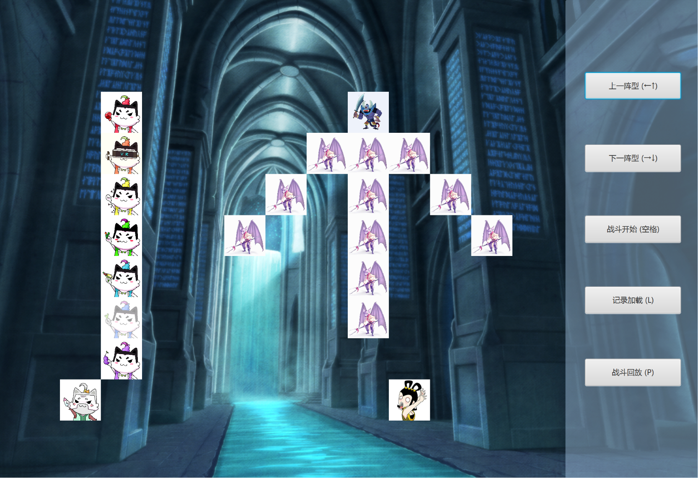

# 史诗巨制悬疑历史动作大片——Battle



-----------------------------------------
## 一、 剧情台本

1. 葫芦七兄弟初始乱序->按长蛇阵依序排队
2. 按下←↑→↓方向键/对应按钮选择阵型，蝎子精带领小喽啰按阵型站队
3. 二者上战场，老爷爷与蛇精各自呐喊助威
4. 控制台显示战场的对峙局面
5. 按下SPACE键/对应按钮，开打
6. 按下L键/对应按钮，加载记录
7. 按下P键/对应按钮，回放

----------------------------------------------------
## 二、 人·景·物分析

### 1. 大戏开幕，演员有谁？

葫芦七兄弟、蝎子精&小喽啰、老爷爷、蛇精
他们均有姓名、阵营、在战场上的位置等共同属性，以Creature类将其囊括：
```java
	class Creature {
		String CName;
		private Factions factions;
		private final LifeState lifeState;
		private final Position position;
		char sign;
		private Image image;
		...
	}
```
为方便打印战场，还为每个人设置了标记。

葫芦兄弟还需要排序，所以有些额外的属性（如顺序seq等），因此定义CalabashBro类：
```java
	class CalabashBro extends Creature {
		private Color color;
		private int placeInQue;
		private int seq;
		...
	}
```

为方便起见，还定义两个需要摆阵型的队列：
```java
	class CBQueue implements CreatureQueueBehaviors {
		List<CalabashBro> broQueue;
		...
	}
	
	class VillainQueue implements CreatureQueueBehaviors {
		private List<Creature> vlQueue;
		int numTotal, numOnField;
		...
	}
```
方便他们排序、摆好阵型，直接打包上战场。

- - - - - - - - - - - - - - -
### 2. 战场布置，上板砖！

两方对战，当然需要一个荒凉、壮阔的战场——BattleField，
而战场上，各方人员需要站位，直接站在黄土上不太好分配位置，给他们几块板砖垫垫脚——
```java
	class Brick<T> {
		char sign;
		T holder;
		...
	}
```
为了方便输出显示战场，每一块砖内都设了一个标记，需要时直接输出即可。而T holder则为板砖上站的T类型事物（如Creature）的引用。

这样，战场上就有了砖：
```java
	class BattleField{
		int row, col;
		Brick<Creature>[][] bricks;
		...
	}
```

有了砖，才能有人，有了人，剧情才能继续跑下去……
然后，才有了史诗巨制悬疑历史动作大片——Battle：
```java
	public class Battle {
		private static final int fieldRowNum = 11, fieldColNum = 13;
		private static BattleField field;
		private static List<Creature> creatures;
		...
	}
```
（剧组穷啊，意思意思铺个11*13板砖就算了……

- - - - - - - - - - - - - - -
### 3. 辅助设备1——先别打！等我先排个序！

蝎子精：这还打不打了！
葫芦娃：大兄dei！稍等片刻！等我召唤个排序器——
```java
	class Sorter {
		private SortAlg alg;
		...
	}
```
自带排序算法引擎！只要998！排序器带回家！（详情请见作业二）

- - - - - - - - - - - - - - -
### 4. 辅助设备2——小喽啰生成器，流水线生产，你值得拥有

在反派队列 VillainQueue 中，蝎子精诞生后，还得一只一只地生成小喽啰，实在是太麻烦了，因此——

先来一个囊括万物的生成器：
```java
	interface Generator<T> {
	    T next();
	}
```

再来一个小喽啰生成器，直接设定好各种参数（名字、阵营、标记）：
```java
	class underlingsGenerator implements Generator<Creature>{
	    public Creature next()  {
	        return new Creature("小喽啰", Factions.EVIL, 'v', "./pic/bat.jpg");
	    }
	}
```

要批量生产，还需要一个能够实现流水生产的生成器：
```java
	class Generators {
		static <T> void fill(Collection<T> clt, Generator<T> gen, int num){...}
	}
```

这样，在蝎子精进入队伍后，只需要一句召唤术语——
```java
	Generators.fill(vlQueue, new underlingsGenerator(), n-1);
```
即可实现小喽啰的批量生产、批量入队了。

- - - - - - - - - - - - - - -
### 5. 阵型预设

两方对战，大阵摆上，阵型当然要预先想好，可定义一个枚举类型直接列举，内置boolean数组直接映射阵型：
```java
	enum Formation {
		OVEREDGE("鹤翼",1), ECHELON("雁行",2), YOKE("冲轭",3), HYDRA("长蛇",4),
		SCALE("鱼鳞",5), SQUARE("方円",6), HOOKEDSPEAR("偃月",7), ARROW("锋矢",8);

		String Cname;
		boolean[][] form;
		int num;
		...
	}
```

- - - - - - - - - - - - - - -
### 6. 战况直播

不在战场上的观众朋友们如何知道战况？作为世界级的大戏，战况实时转播怎么能少——
```java
	public class UIUpdater{
		private GraphicsContext gc;
		private Timeline timeline;
		private static Map<Character, Image> imageMap = new HashMap<>();
		...
	}
```
专业的UIUpdater为您带来高清的图像显示与精准的战况直播，你，值得拥有。

- - - - - - - - - - - - - - -
### 7. 精彩好戏，不容错过——场记走起！

-哎呀，我昨晚又错过葫芦娃妖精大戏的直播啦！  
-你没看通告吗？现在有重播啦——

剧组通告：
为回馈广大人民群众对本剧的热爱与支持，本剧组耗巨资购入记录与回放设备，每周五晚定时重播，请各位准备好板凳与瓜子。  
葫芦娃大战妖怪剧组

设备展示台：
```java
	public class BattleRecorder {
	    private DataOutputStream out;
		...
	}

	public class RecordLoader {
	    private DataInputStream in;
	    private FileChooser fileChooser;
	    File file;
		...
	}
```
在战斗期间，BattleRecorder不断获取战场上的信息并写入文件，随后，则可通过RecordLoader加载，并结合其它设备回放——错过直播的朋友可以放一百万个心了！

- - - - - - - - - - - - - - -
### 8. 总戏台与总控台——一切在手，天下我有！

继承自Application类的Main为总戏台入口，搭建有主舞台primaryStage、场景scene等戏台设施：
```java
public class Main extends Application{...}
```
而包括总戏台、所有演员、道具等在内的事物，则由身兼导演、统筹等职位的总控台MainController统筹安排：
```java
	public class MainController  {
	    private Scene mainScene;
		private UIUpdater uiUpdater;
	    private BattleRecorder battleRecorder;
	    private RecordLoader recordLoader;
		private static Battle battle;
		...
	}
```

----------------------------------------------------
## 三、 剧本/人物情节分析

### 1. 葫芦七兄弟排序

葫芦七兄弟还是需要乱站+排序，所以可以基本沿用作业二的设定（葫芦娃、葫芦娃队列、排序器、排序算法...），此处不再赘述。

- - - - - - - - - - - - - - -
### 2. 两队列按阵型上战场、变阵 & 老爷爷、蛇精上战场
 
对于该类情节，均有个人踏上战场的部分，而变阵也可以视为下战场-摆好阵型-再上战场的行为，因此**踏上战场（的某块砖）、离开战场（的某块砖）**均可视为生物的共有行为——
```java
	class Creature {
		...
		void stepOn(BattleField field, int r, int c) {...}
		void leave(BattleField field){...}
	}
```

对于踏上某块砖，可表示为：  
	- 将这块砖的位置记录在自己的位置信息中  
	- 将这块砖打上自己的标记  
	- 将这块砖与自己建立联系（砖中的holder引用指向自己）
	
而对于离开某块砖，则可表示为：  
	- 修改自己的位置信息  
	- 擦除这块砖上自己的标记，修改为无人标记  
	- 擦除这块砖与自己的联系（砖中的holder引用置空）
	
- - - - - - - - - - - - - - -
而对于两个阵列的上战场，为整体行为，可以设置好阵型，一下子跳上战场：
```java
	class VillainQueue implements CreatureQueueBehaviors {
		...
		void JumpOntoField(BattleField field, Formation form){...}
		void leaveField(BattleField field) {...}
	}
	
	class VillainQueue implements CreatureQueueBehaviors {
		...
		void JumpOntoField(BattleField field, Formation form){...}
	}
```

其中，JumpOntoField为对战双方在战场上的共同行为——因此，将这共同行为作为一种行为规范/接口，具体实现由双方各自决定：
```java
	interface CreatureQueueBehaviors {
	    void JumpOntoField(BattleField field, Formation form);
	}
```

JumpOntoField具体实现时，还是按照阵型的映射，一个一个依次 stepOn 战场。

- - - - - - - - - - - - - - -
### 3. 战斗开始！冲啊！
战场上的生物均实现了Runnable接口，通过搭载线程，可以开始冲锋陷阵——
```java
	public void run() {...}
```

战场上葫芦娃们和妖怪们到底要干嘛？run方法可以说是他们的《战场行为准则》，简称《关于葫芦娃妖怪大战的十五项规定与八大原则》（大误）。具体而言，他们需要做的有：  
- 当我活着，当我面前还有敌人（深情朗诵语气）：  
	- 有目标敌人吗？还活着吗？没有？去找啊——
```java
	tgEnemy = searchForEnemy(enemyList);
```
	- 确定敌人，大步向敌人迈去——
		
```java
	stepForward(tgEnemy);
```
	- 前行时检查周边八连通的区域，若有敌人？开打！
```java
	checkAndAttack();
```
- 自己挂了咋办？躺一会儿尸再上天吧——
```java
	TimeUnit.MILLISECONDS.sleep(500);
	leave(field);
```

- - - - - - - - - - - - - - -
考虑到战场上位置有限，总不能大家在一块砖上人挤人挤人挤人挤人吧？
于是，**砖**，毫不起眼的砖，成了大家宝贵的共享资源，与其相关的、多线程读写的代码被设为**临界区**。

另外，为了防止出现 “有的人活着，然而他已经死了；有的人死了，但是他还活着” 以及 “ 你看到我在这，但其实我不在这；我在这里，我又不在这里” 这样的哲学问题，对于战场上**生命体的位置**```javaPostion```、**生命状态**```javaLifeState```（会多人读写访问），其相关的代码也需要**设置临界区**，同一时刻仅能一人读或写。


----------------------------------------------------
## 四、 各项统筹控制工作

演员演好戏，这就没了吗？事情还多着呢！（导演！你瞅瞅你重金买回来的设备啊！！！）

### 1. 戏台铺设与初始化

主戏台Main中需要铺设场景、设置准备各控件，还要召唤总控台——
```java
	public void start(Stage primaryStage) {
		...
		Parent root = fxmlLoader.load();
		MainController controller = fxmlLoader.getController();
		...
		primaryStage.show();
	}
```
其中，总控台MainController还要进一步进行初始准备工作：
```java
	void init(Stage stage, Scene scene, double height, double width) {
		...
		uiUpdater.showBattleField();
		...
		mainScene.setOnKeyPressed(new EventHandler<KeyEvent>() {...});
		...
	}
```
在将舞台大小等参数传给uiUpdater初始化后——  
总控台：“**uiUpdater！大兄弟！醒醒！有活干了！**”  
总控台：“**mainScene，你给我瞅着点啊，别把键盘按下事件放跑啦！**”  

另外，背景、按钮等布景、控件由MainController对应的MainWindow.FXML文件中读取。

- - - - - - - - - - 
### 2. 战场状况显示

对于UIUpdater，初始化时新建一个Timeline，通过其控制不断获取战场状态并输出显示。
具体而言，在```java void showBattleField()```方法中，UIUpdater读取战场上的砖块，若上面有人，就在对应位置显示其图片：
```java
	gc.drawImage(image, startPtX + imageSz * c, startPtY + imageSz * r, imageSz, imageSz);
```
如果他挂了，再为他盖上一块灰纱（**为死亡蒙上一层阴影……**）:
```java
	gc.fillRect(startPtX + imageSz * c, startPtY + imageSz * r, imageSz, imageSz);
```

- - - - - - - - - - - - - - -
### 3. 战斗的号角吹响时——

※ 战斗的号角：键盘按下SPACE键，或鼠标点击对应按钮

此时，总控台判断是否在回放、战斗，如果没有，可以开始战斗啦：
```java
	void startBattle(){
		battleRecorder = new BattleRecorder(battle);
		...
        battle.battleBegin();
		...
    }
```
总控台创建BattleRecorder并告知其开始记录，并通知战斗开打。  
在BattleRecorder中通过新建```java DataOutputStream```进行输出，获取战场信息并记录。  
而在Battle的```java public void battleBegin();```方法中，则通过新建线程池，并execute每个活着的生物，大家便可以跑起来啦！

- - - - - - - - - - - - - - -
### 4. 吃瓜群众：我要看重播——开始加载记录吧！

群众：按下L键or对应按钮，滴，加载卡。

控制台：来来来！你要看哪一场——
```java
	void loadRecord() {
        recordLoader = new RecordLoader(mainStage);
        recordLoader.openFile();
		...
		uiUpdater.replayPrepare(...);
		...
    }
```
控制台通知recordLoader准备，并让观众选择重播场次（RecordLoader中new一个```java FileChooser```让观众选择文件，并新建对应的```java DataInputStream```),随后通知uiUpdater更新实时画面，设置重播标志位，准备重播。

- - - - - - - - - - - - - - -
### 4. 吃瓜群众：我要看重播——回放开始吧！

群众：按下P键or对应按钮，滴，回放卡。

控制台：来来来！uiUpdater，干活了——
```java
	void replayBattle() {
        ...
		uiUpdater.replayBegin();
		...
    }
```
在UIUpdater中，则根据文件中输入的信息进行战场显示，原理与之前的战场状况显示一致，此处不再赘述。


-----------------------------------------------------------

### 由此，以战场为舞台，双方对阵，风云变幻……

-----------------------------------------------------------
## 五、 总结与心得

1. 曹老师曰：面向对象编程，是反映现实世界的，写代码像画动画片一样……

2. 运用曹老师的“动画片思想”，编程时，从“创世者”的角度考虑——
在一场战争中，我需要new一个BattleField，BattleField上有Brick，Brick上面可以站Creature，Creature有很多种，大家都可以stepOn战场、leave战场，需要摆阵型时，还可以直接先排排坐，~~吃果果~~一个一个摆好位置再JumpOntoField，一步一步细化下去。

3. 关于抽象、封装、继承与多态：
	- 对于某些类，若有共同的属性、行为，可提取共同点，先定义基类，而这些类则可作为子类定义。关于抽象-封装-继承-多态的概念，需在实践中不断加深理解。抽象对外部而言，仅需知道接口、操作。封装对外屏蔽细节，将数据与具体实现隐藏在内部。通过继承，子类可重用父类代码/行为功能，亦可对父类方法进行重写，实现自己独特的行为，体现多态。

4. 关于Colletion：
	- 结合泛型指定容器中的对象类型，可自动调整大小。留心List, Set, Queue和Map的特点及其各种实现的区别、iterator的应用。

5. 关于Generics：
	- 泛型可运用于类、接口、方法。注意java中的泛型与c++中模板的区别——java中泛型使用擦除实现，使得运行时具体的类型信息因被擦除而无法获得，而擦除的补偿包含类型标签的传递、工厂化方法、强制转型（数组）等。另外，还需注意泛型的边界与通配符问题——注意赋值两边的object是否类型对等（be type-equivalent to）的。

6. 关于并发编程：
	- 注意可能发生争抢（多线程读写）的共享资源是哪些，注意临界区的设置、各线程之间的竞争/协同关系。对于实现Runnable接口的类，可搭载一个线程跑起来。对于线程而言，可直接new Thread，也可建立线程池，方便管理。

7. 关于I/O：
	- 要注意面向字节与面向字符的输入输出流的区别。装饰器模式的运用可将几种流的特点组合，对原有流处理器的功能进行改善。注意不同的输入输出流在不同场合下的应用——对象序列化、读写文本文件、格式化输入输出、存储与恢复数据……

8. 关于设计原则：
	- 在SOLID五大设计原则以及合成/聚合复用原则、迪米特法则中，均十分强调类于类、类与接口之间的设计关系，尤其是接口对改善设计的运用。
	- 如，在依赖倒置原则中，上层通过接口操作，而非直接依赖于下层，减少了二者耦合度。重点与关键：对抽象编程，而非对实现编程。
	- 又如，对于里氏替换原则，引用基类之处须透明地使用子类对象，如本程序中基类Creature与子类CalabashBro，这样的设计极大地提高代码的重用性与通用性，对于其他类而言，只需知道是Creature，而不必关心是葫芦娃还是妖精。
	- 在接口、抽象层次方面，以及模块之间的耦合方面，还需要不断实践提升。